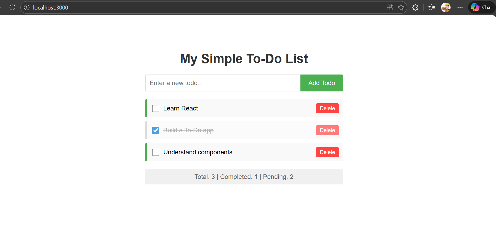

# React To-Do List App

A simple, To-Do List application built with React. Perfect for understanding the basic flow and concepts of React.

## Features

- ✅ Add new todos
- ✅ Mark todos as complete/incomplete
- ✅ Delete todos
- ✅ Real-time statistics
- ✅ Responsive design
- ✅ No external dependencies

### 🔗 Live Demo: [https://react-todo-list-byvinay.netlify.app/)

## Screenshot



## How to Run Locally

1. **Clone the repository**
   ```bash
   git clone https://github.com/yourusername/react-todo-list-beginner.git
   cd react-todo-list-beginner
